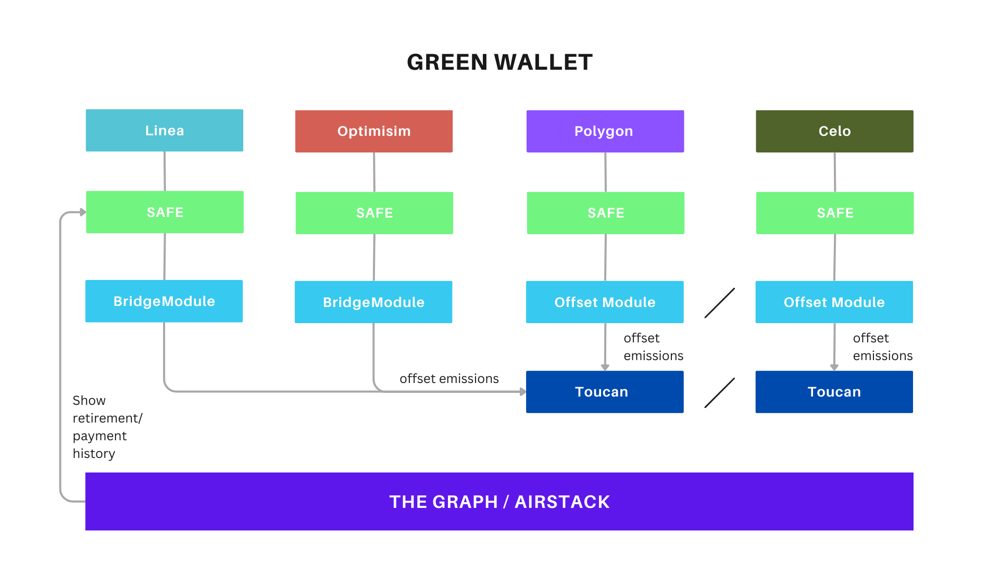

# Welcome to GreenWallet! 🌻

Blockchain still not net-zero and we can feel the climate change every day. So it is time for everyone and especially companies with high transaction volume be aware of their impact in all spaces.

**GreenWallet** is an eco-friendly, chain-agnostic wallet that accounts for your blockchain transactions by offsetting your carbon footprint.

## Greenstart your way

```
git clone https://github.com/GigaHierz/green-wallet
cd green-wallet
yarn install
yarn start
```

Open [http://localhost:3000](http://localhost:3000) to view it in the browser.

## Green wallet details

**GreenWallet** is a chain-agnostic DeFi app that simplifies eco-friendliness by automating carbon offsets for blockchain transactions.
GreenWallet aims to give the environmentally aware user a clean consciousness while browsing web3.
While the user has a seamless experience, GreenWallets mechanisms tracks the emission of the transactions and calculate the according carbon footprint.

### Project Description

This project was created out of the idea to create a wrapper around wallets that automatically retires carbon credits to account for the emissions of transactions.

Of course we don't want to offset every transaction with a transaction, so we decided to offset in batches (after 500 tx - number has to be calculated more in detail, see Offsetra). Carbon Offsetting on-chain is still a hussle, as there are different procedures, different standards and even though on-chain carbon credits are way more liquid on-chain than off-chain, you can only get them on certain chains and only a few exchanges.

In the case of the wallet, the user should not have to bother with that. When creating the wallet they can decide on a price tier regarding the quality of the carbon credits to offset. This can be changed later if the proposal is accepted.

Everybody loves to be environmentally friendly, but as soon as it gets too complicated, they drop out as long as there is no value. That's why we created Green Wallet.

Poaps, Leaderboards and implementation in social apps is in the future as this is always a great marketing tool while raising awareness at the same time.

## How it's Made

The base of our project was Safe (Gnosis). The carbon offsetting was done by using Toucan's infrastructure.

The goal was to add two different modules integrated with the "Safe{Core} Protocol " to the Safe, based on if the Safe is on Celo & Polygon, in which case, the module would just check if the 500 transactions have been reached and if they did, would send a defined amount of tokens to our OffsetContract that would then offset the tokens. In our case, as it is a contract that always does the same, doing a swap (from ERC20 to carbon token) for every offset, does not seem very sustainable, so we added an automation to the contract in which case it would automatically swap deposited ERC20 tokens for carbon tokens, when the carbon tokens reach a certain low.



We are also providing a gasless experience to incentivice the user to use our wallet.

If the Safe was created on another chain, there will be a BridgeModule that will send a message to the OffsetHelper on Celo or Polygon using Hyperlane or an existing Safe Bridge Module. Bridging will be possible from Optimism, GnosisChain, and also Linear and PolygonzkEVM once they are implemented.

The frontend of our project leveraged Node.js, JavaScript, and TypeScript to develop the core functionalities off our application.To enhance the user interface and ensure flexibility and scalability, we employed and Bootstrap Tailwind.

The core of the blockchain foundation is based on Gnosis Safe, The Graph, GraphQL, Gelato and the Toucan SDK.

## Who are we?

And here is the team that brought their indelible mark at EthGlobal Lisbon 2023! 🔮

We are a team of 5 tech wizards, with expertises from different domains and different background:

🍉 Valerie - Https://GitHub.com/vmlvaske

🍉 Irene - https://github.com/IreneBa26

🍉 Sam - https://github.com/i-am-sam-codes

🍉 Lena - https://github.com/GigaHierz

🍉 Zoe - https://github.com/zoefleischer
